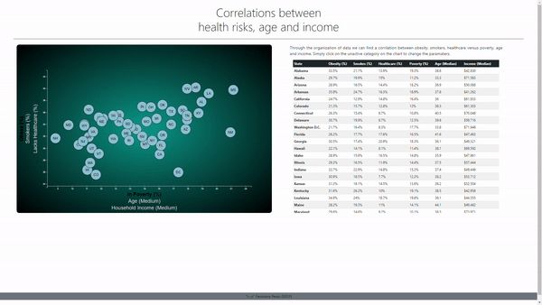

## Inteartive Dashboard (US Census Data)
Analyzed the current trends shaping people's lives, as well as created charts, graphs, and interactive elements to help readers understand findings.  Sifting through information from the U.S. Census Bureau and the Behavioral Risk Factor Surveillance System based on 2014 ACS 1-year estimates from the [US Census Bureau](https://data.census.gov/cedsci/), the current data set includes data on rates of income, obesity, poverty, etc. by state. MOE stands for "margin of error."

* Utilized **html, Javascript and D3 library** to create a scatter plot between two of the data variables such as `Healthcare vs. Poverty` or `Smokers vs. Age` that represents each state with circle elements.  Pulled in the data from `data.csv` by using the `d3.csv` function. Included state abbreviations in the circles and tool-tip.

